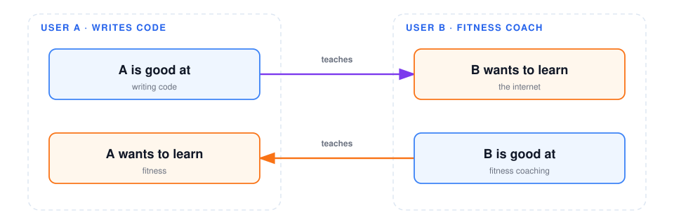

  

# Verso

[ English ](README.md) | [ 简体中文 ](docs/README/README.md)

**Verso matches complementary people. It does not match like-minded ones.**

> Most social products thicken the filter bubble: they pair you with people who already share your domain, taste, and worldview. Verso does the opposite. It uses a question to pair two people who can teach each other — different fields, different ways of thinking — so both leave knowing something they did not.

The name is **Verso**; the other side of a page. Two sides look opposed. Closed, they are one sheet.

---

## The match

A match succeeds only when both sides complete each other:

| This side                        | Gets                          |
| -------------------------------- | ----------------------------- |
| What you are good at             | Taught to someone who is not  |
| What you want to learn this time | Learned from the other person |

Same-topic, same-article, and same-question pairing are out of scope. Authorized Zhihu articles, follows, and favorites only build a strengths portrait. They are not a chat map, and they are not the match condition.

---

## Resources

- Product proposal: [#30](https://github.com/xiaocheny214/verso/issues/30)
- Codebase map: [docs/codebase-map.md](docs/codebase-map.md)
- How to contribute: [CONTRIBUTING.md](CONTRIBUTING.md)

---

## License

Proprietary commercial. See [LICENSE](LICENSE).
