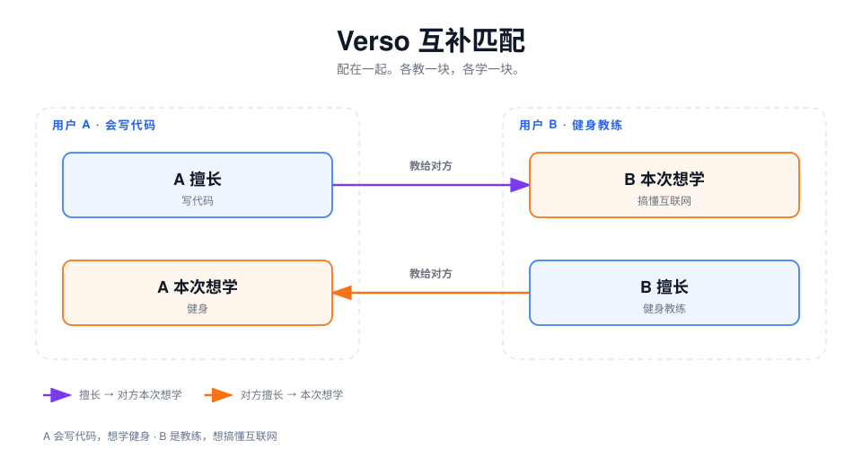

  

# Verso / 背叶

[ English ](../../README.md) | [ 简体中文 ](README.md)

**Verso 匹配的是能力互补的人，不是志趣相投的人。**

> 多数社交产品会把信息茧房越织越厚：把领域相近、口味相近、认知相近的人配在一起。Verso 反过来做。它借助一个问题，把能互相教一块的两个人配上——领域不同，认知不同——让双方都能带走自己原本没有的东西。

中文名是 **背叶**，即书页的背面。两边看起来对立，合上才是一张纸。

---

## 匹配条件

只有两边同时补上对方，才算匹配：

| 这一侧       | 得到什么       |
| ------------ | -------------- |
| 你擅长的     | 教给还不会的人 |
| 你这次想学的 | 从对方那里学到 |

同话题、同一篇文章、同一个问题配人，都不在范围内。授权后的知乎文章、关注、收藏只用来生成擅长画像，不是聊天地图，也不是匹配条件本身。

---

## 许可

专有商业许可，见 [LICENSE](../../LICENSE)。
